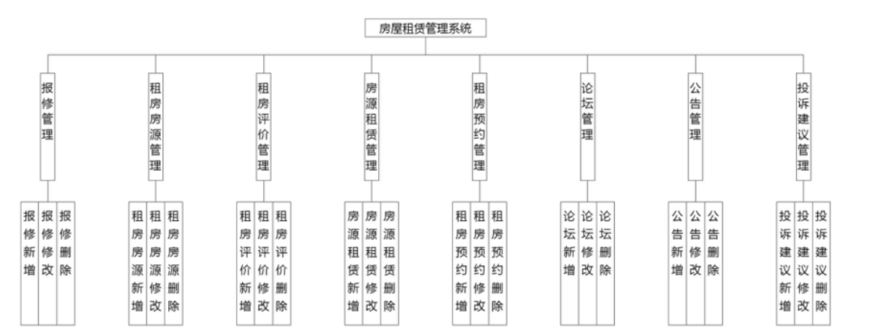
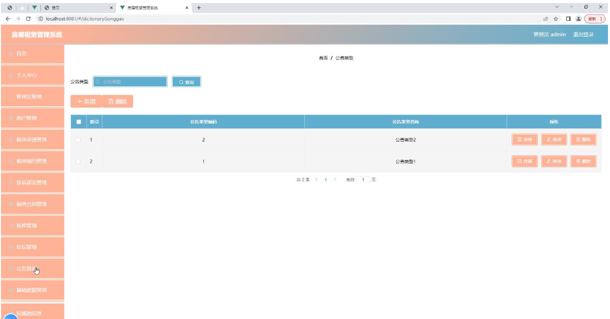
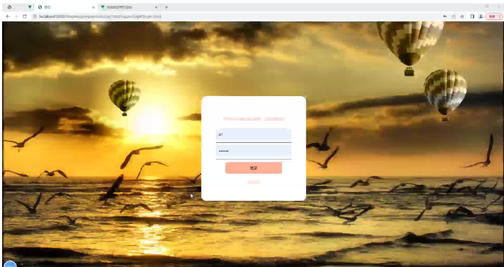
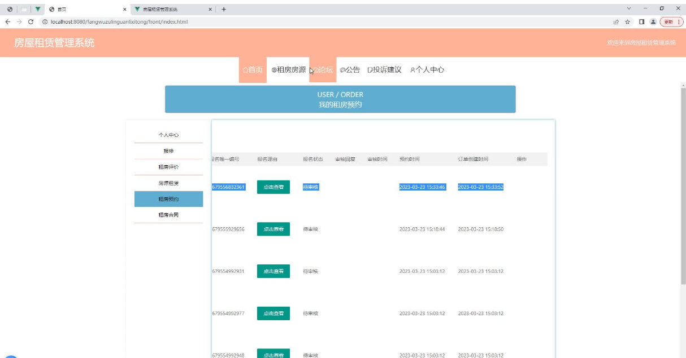
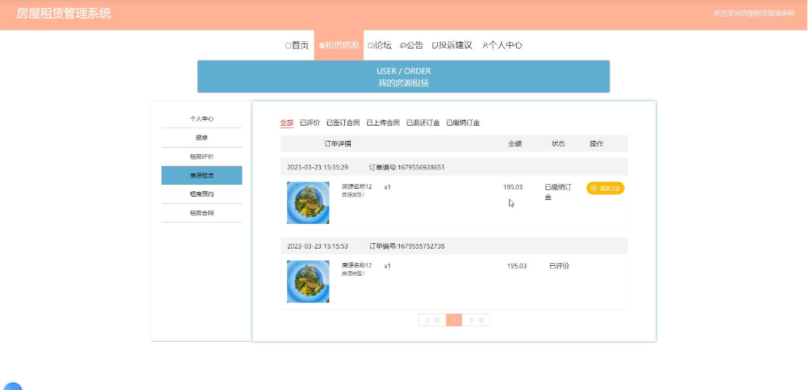
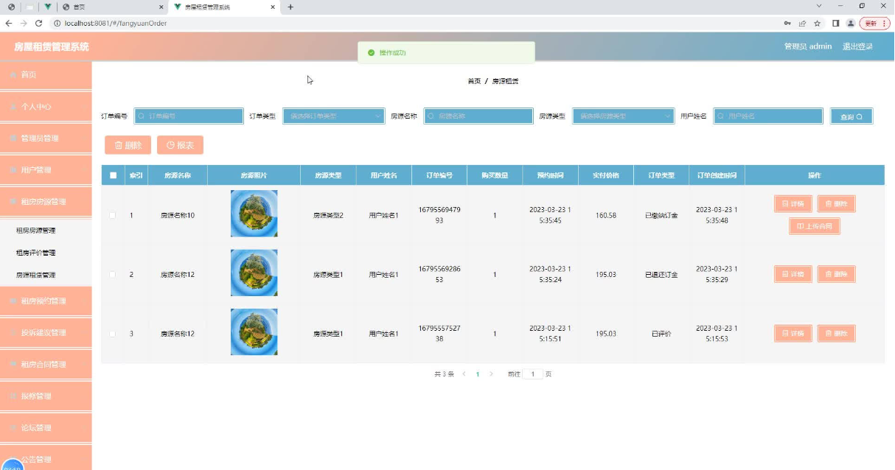
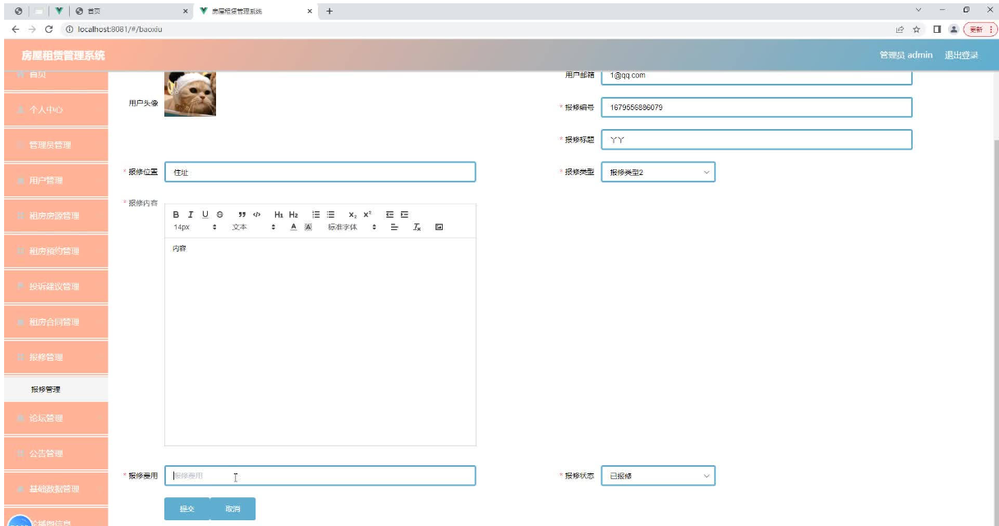
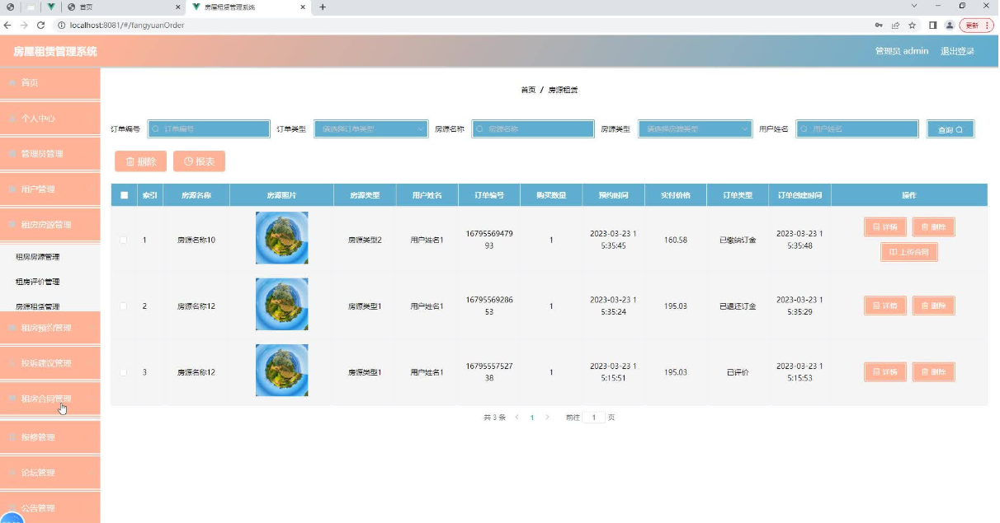

## 基于springboot的房屋租赁管理系统

* * *

## 一、项目介绍

    
房屋租赁管理系统管理系统按照操作主体分为管理员和用户。管理员的功能包括报修管理、字典管理、租房房源管理、租房评价管理、房源租赁管理、租房预约管理、论坛管理、公告管理、投诉建议管理、用户管理、租房合同管理、管理员管理。用户的功能等。该系统采用了Mysql数据库，Java语言，Spring Boot框架等技术进行编程实现。  
房屋租赁管理系统管理系统可以提高房屋租赁管理系统信息管理问题的解决效率，优化房屋租赁管理系统信息处理流程，保证房屋租赁管理系统信息数据的安全，它是一个非常可靠，非常安全的应用程序。

关键词：房屋租赁管理系统管理系统；Mysql数据库；Java语言

## 二、开发环境

开发语言：Java  
框架：springboot  
JDK版本：JDK1.8  
服务器：tomcat7  
数据库：mysql  
数据库工具：Navicat11  
开发软件：eclipse/myeclipse/idea  
Maven包：Maven  
————————————————

## 三、功能介绍

房屋租赁管理系统管理系统根据使用权限的角度进行功能分析，并运用用例图来展示各个权限需要操作的功能。

图4.1即为设计的管理员功能结构，管理员权限操作的功能包括管理公告，管理房屋租赁管理系统信息，包括房源管理，报修管理，报修管理，公告管理等，可以管理投诉建议。
  



图4.1 管理员功能结构

## 四、核心代码

部分代码：

```c
package com.example.controller;

import cn.hutool.core.util.StrUtil;
import cn.hutool.crypto.SecureUtil;
import com.example.common.Result;
import com.example.common.ResultCode;
import com.example.entity.Caiwu;
import com.example.exception.CustomException;
import com.example.service.CaiwuService;
import com.example.utils.MapWrapperUtils;
import com.example.utils.jwt.JwtUtil;
import com.example.vo.CaiwuVo;
import org.springframework.beans.BeanUtils;
import org.springframework.web.bind.annotation.*;

import javax.annotation.Resource;
import javax.servlet.http.HttpServletRequest;
import java.util.HashMap;
import java.util.List;
import java.util.Map;

@RestController
@RequestMapping(value = "/caiwu")
public class CaiwuController {

    @Resource
    private CaiwuService caiwuService;

    @PostMapping
    public Result<Caiwu> add(@RequestBody CaiwuVo caiwu) {
        caiwuService.add(caiwu);
           return Result.success(caiwu);
    }
	
	

    @PostMapping("/deleteList")
    public Result<Caiwu> deleteList(@RequestBody CaiwuVo caiwu) {
        caiwuService.deleteList(caiwu.getList());
        return Result.success();
    }

    @DeleteMapping("/{id}")
    public Result delete(@PathVariable Long id) {
        caiwuService.delete(id);
        return Result.success();
    }

    @PutMapping
    public Result update(@RequestBody CaiwuVo caiwu) {
        caiwuService.update(caiwu);
        return Result.success();
    }

    @GetMapping("/{id}")
    public Result<Caiwu> detail(@PathVariable Integer id) {
        Caiwu caiwu = caiwuService.findById(id);
        return Result.success(caiwu);
    }

    @GetMapping
    public Result<List<Caiwu>> all() {
        return Result.success(caiwuService.list());
    }

    @PostMapping("/page")
    public Result<CaiwuVo> page(@RequestBody CaiwuVo caiwuVo) {
        return Result.success(caiwuService.findPage(caiwuVo));
    }
	    @PostMapping("/login")
    public Result login(@RequestBody Caiwu caiwu, HttpServletRequest request) {
        if (StrUtil.isBlank(caiwu.getZhanghao()) || StrUtil.isBlank(caiwu.getMima())) {
            throw new CustomException(ResultCode.PARAM_LOST_ERROR);
        }
        Caiwu login = caiwuService.login(caiwu);
//        if(!login.getStatus()){
//            return Result.error("1001","状态限制，无法登录系统");
//        }
        if(login != null) {
            HashMap hashMap = new HashMap();
            hashMap.put("user", login);
            Map<String, Object> map = MapWrapperUtils.builder(MapWrapperUtils.KEY_USER_ID,caiwu.getId());
            String token = JwtUtil.creatToken(map);
            hashMap.put("token", token);
            return Result.success(hashMap);
        }else {
            return Result.error();
        }
    }
    @PutMapping("/updatePassword")
    public Result updatePassword(@RequestBody Caiwu info, HttpServletRequest request) {
        Caiwu caiwu = caiwuService.findById(info.getId());
        String oldPassword = SecureUtil.md5(info.getMima());
        if (!oldPassword.equals(caiwu.getMima())) {
            return Result.error(ResultCode.PARAM_PASSWORD_ERROR.code, ResultCode.PARAM_PASSWORD_ERROR.msg);
        }
        info.setMima(SecureUtil.md5(info.getNewPassword()));
        Caiwu caiwu1 = new Caiwu();
        BeanUtils.copyProperties(info, caiwu1);
        caiwuService.update(caiwu1);
        return Result.success();
    }
}

```

## 五、效果图








## 六、 [更多好项目1](https://blog.csdn.net/weixin_42182741/article/details/143714650)，[更多好项目2](https://blog.csdn.net/weixin_42182741/article/details/143715759)

##### 七、感谢大家的点赞和转发，跟多优质项目将会和大家一一分享
